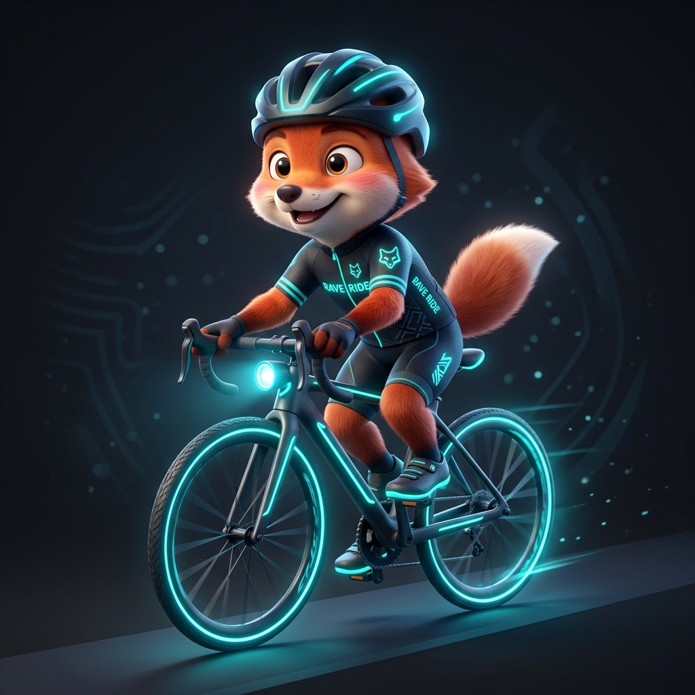

<div align="center">

  

  # ⚡ Aetron - Next-Gen Fitness & Exercise Application
  
  **A Smart Fitness Tracking & Analytics Platform Powered by Flutter, Supabase & 3D Visual Design**

  [](https://flutter.dev)
  [](https://dart.dev)
  [](https://supabase.com)
  [](https://riverpod.dev)
  []()

</div>

---

## 🌟 Product Overview

**Aetron** is a modern, product-focused fitness & activity tracking mobile application built with **Flutter & Supabase**. Engineered for seamless workout experiences, Aetron combines **high-precision GPS route tracking**, **smart indoor/outdoor environment auto-detection**, **MET-based medical calorie calculations**, and a **stunning 3D visual design system** to empower users on their daily fitness journey.

---

## 🔥 Key Product Features

### 1. 🏃 Realtime Route & Precision GPS Engine
- **Intelligent GPS Filtering:** Automatically filters location noise (`<0.25m` displacement rejection), applies velocity smoothing (`Smoothed Speed`), and detects auto-pause states.
- **Environment Classifier (Indoor vs. Outdoor):** Dynamically detects indoor workouts (e.g., treadmill running) and intelligently transitions tracking to pedometer/accelerometer sensors to optimize battery consumption.
- **Interactive Map Routes:** Renders live route lines and dynamic 3D location markers with real-time feedback.

### 2. 🎨 Aetron 3D Visuals & Premium User Experience
- **Aetron Design System:** Modern dark mode with sleek glassmorphism elements, refined typography, elevation depth, and fluid micro-animations.
- **Vibrant 3D Visual Assets:** Features customized 3D character avatars (Shiba mascot) and activity-specific 3D badges (*Running, Cycling, Walking*).

### 3. 📊 Medical-Grade MET Analytics & Calorie Estimation
- **Biometric Calorie Calculation:** Computes burned energy based on user profile parameters (Height, Weight) and real-time velocity MET multipliers.
- **Progress Visualization & History:** Interactive analytical charts powered by `fl_chart` and structured calendar views via `table_calendar`.
- **Consistency Feedback System:** Analyzes workout frequency and patterns to deliver personalized habit-building insights.

### 4. 🎯 Personal Goals & Smart Notifications
- **Goal Setting:** Define and track progress towards personal milestones (*Distance, Burned Calories, Active Duration*).
- **Smart Push Reminders:** Configurable local push notifications designed to keep users accountable and motivated.

### 5. 🔒 Offline-First Architecture & Enterprise Security
- **Offline-First Storage:** Local database layer powered by **Isar DB & SQLite** ensures seamless workout recording even without network connectivity.
- **Cloud Sync Engine:** Securely synchronizes provisional and finalized workout sessions with Supabase Cloud backend once online.
- **Enhanced Account Security:** Built-in Google OAuth integration, email/password authentication, and enforced strong password upgrade policies.

---

## 📸 Product Visual Showcase

| 3D Running | 3D Cycling | 3D Walking | 3D Shiba Mascot |
| :---: | :---: | :---: | :---: |
|  |  |  |  |

---

## 🛠️ Technology Stack

| Category | Technologies / Libraries |
| :--- | :--- |
| **Mobile Framework** | [Flutter 3.x](https://flutter.dev) (Dart 3.x) |
| **State Management** | [Riverpod 2.x](https://riverpod.dev) with `riverpod_generator` |
| **Backend & Cloud** | [Supabase](https://supabase.com) (Auth, PostgreSQL DB, Storage, Edge Functions) |
| **Local Persistence** | [Isar Database](https://isar.dev) & `sqflite` (NoSQL & SQLite offline engine) |
| **Location & Sensors** | `geolocator`, `flutter_map`, `pedometer`, `sensors_plus` |
| **UI & Data Viz** | `fl_chart`, `table_calendar`, Custom Aetron UI Design Tokens |
| **Model Generation** | `freezed`, `json_serializable` |

---

## ⚡ Getting Started

### Prerequisites:
* **Flutter SDK:** `>= 3.19.0`
* **Dart SDK:** `>= 3.3.0`
* **Android Studio / Xcode** for mobile device emulation or deployment.

### Quick Setup Steps:

1. **Clone the Repository:**
   ```bash
   git clone https://github.com/DB-Ducbao113/FitnessExerciseApplication.git
   cd FitnessExerciseApplication
   ```

2. **Install Dependencies:**
   ```bash
   flutter pub get
   ```

3. **Configure Environment Variables (.env):**
   Create a `.env` file in the project root directory and add your Supabase credentials:
   ```env
   SUPABASE_URL=https://your-supabase-project.supabase.co
   SUPABASE_ANON_KEY=your-anon-key
   ```

4. **Launch the Application:**
   ```bash
   # Run on connected Android / iOS device or emulator
   flutter run
   ```

---

## 🛣️ Product Roadmap

- [x] High-precision GPS tracking & automatic noise rejection pipeline.
- [x] Aetron 3D Visual UI Design System & glassmorphism theme.
- [x] Offline-First local database architecture with Supabase Cloud Sync.
- [x] Custom goal setting & smart push notifications system.
- [ ] **AI Personal Coach (Upcoming):** Real-time AI post-workout insights based on heart rate trends & pace performance.
- [ ] **Social Leaderboards & Challenges:** Connect with friends and participate in community fitness challenges.

---

## 📄 License

Distributed under the **MIT License**. See `LICENSE` for more information.

---

<div align="center">
  <sub>Engineered with ❤️ by <b>Nguyen Duc Bao (DB-Ducbao113)</b> 🚀</sub>
</div>
