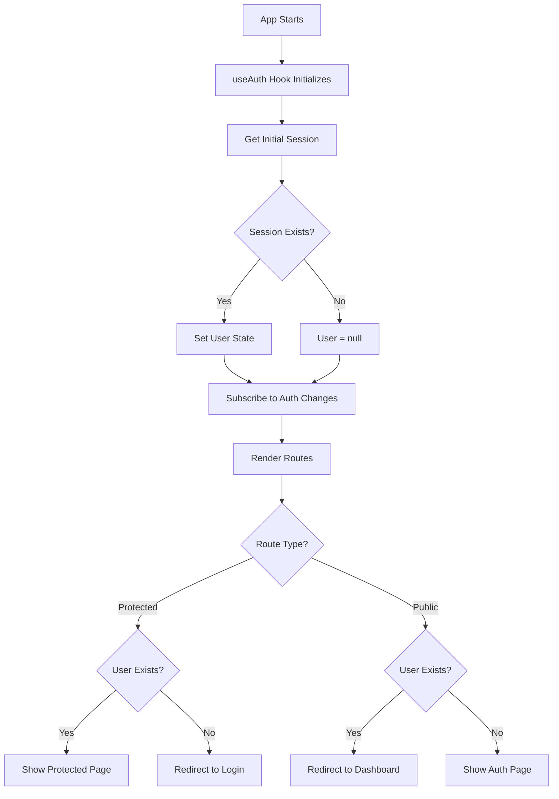

# Authentication System Walkthrough

Production-grade authentication system for fitness tracking application using
React, TypeScript, and Supabase.

## ✅ What Was Built

A complete, production-ready authentication flow with:

- Email/password authentication
- Session persistence across page reloads
- Protected route guards
- Automatic session refresh
- Clean error handling and loading states
- Full TypeScript type safety

## 📁 Project Structure

```
frontend/
├── src/
│   ├── components/
│   │   ├── ProtectedRoute.tsx    # Guard for authenticated routes
│   │   └── PublicRoute.tsx       # Guard for auth pages
│   ├── hooks/
│   │   └── useAuth.ts            # Reactive auth state hook
│   ├── lib/
│   │   └── supabase.ts           # Supabase client singleton
│   ├── pages/
│   │   ├── Login.tsx             # Login page
│   │   ├── Register.tsx          # Registration page
│   │   └── Dashboard.tsx         # Protected dashboard
│   ├── router/
│   │   └── index.tsx             # Route configuration
│   ├── services/
│   │   └── auth.service.ts       # Auth service wrapper
│   ├── styles/
│   │   └── global.css            # Global styles
│   ├── types/
│   │   └── auth.types.ts         # TypeScript definitions
│   ├── App.tsx                   # Root component
│   ├── main.tsx                  # Entry point
│   └── vite-env.d.ts            # Vite types
├── index.html                    # HTML shell
├── package.json                  # Dependencies
├── tsconfig.json                 # TypeScript config
├── vite.config.ts               # Vite config
├── .env.example                 # Environment template
└── README.md                    # Documentation
```

## 🔑 Key Implementation Details

### 1. Supabase Client ([src/lib/supabase.ts](file:///c:/IU/PreW2/fitness_exercise_application/frontend/src/lib/supabase.ts))

Single source of truth for Supabase instance with:

- Anon key only (no service role key)
- Auto token refresh enabled
- Session persistence enabled
- URL detection for OAuth flows

### 2. Auth Service ([src/services/auth.service.ts](file:///c:/IU/PreW2/fitness_exercise_application/frontend/src/services/auth.service.ts))

Clean wrapper providing:

- `signIn()` - Email/password login
- `signUp()` - User registration
- `signOut()` - Session termination
- `getSession()` - Current session retrieval
- `onAuthStateChange()` - Auth state listener

### 3. useAuth Hook ([src/hooks/useAuth.ts](file:///c:/IU/PreW2/fitness_exercise_application/frontend/src/hooks/useAuth.ts))

React hook managing auth state:

- Fetches initial session on mount
- Subscribes to auth state changes
- Provides `user`, `session`, and `loading` state
- Auto-cleanup on unmount

### 4. Route Guards

**ProtectedRoute**
([src/components/ProtectedRoute.tsx](file:///c:/IU/PreW2/fitness_exercise_application/frontend/src/components/ProtectedRoute.tsx)):

- Blocks unauthenticated users
- Redirects to `/login`
- Shows loading spinner during session check

**PublicRoute**
([src/components/PublicRoute.tsx](file:///c:/IU/PreW2/fitness_exercise_application/frontend/src/components/PublicRoute.tsx)):

- Redirects authenticated users to `/dashboard`
- Prevents logged-in users from accessing auth pages

### 5. Routing ([src/router/index.tsx](file:///c:/IU/PreW2/fitness_exercise_application/frontend/src/router/index.tsx))

Route configuration:

- `/` → Redirects to `/dashboard`
- `/login` → Login page (public route)
- `/register` → Registration page (public route)
- `/dashboard` → Main app (protected route)
- `*` → Catch-all redirects to `/dashboard`

## 🚀 Setup Instructions

### 1. Install Dependencies

Dependencies are already installed. If needed:

```bash
cd c:\IU\PreW2\fitness_exercise_application\frontend
npm install
```

### 2. Configure Environment Variables

Edit [.env](file:///c:/IU/PreW2/fitness_exercise_application/frontend/.env) with
your Supabase credentials:

```env
VITE_SUPABASE_URL=https://your-project.supabase.co
VITE_SUPABASE_ANON_KEY=your-anon-key-here
```

**Where to find these:**

1. Go to your Supabase project dashboard
2. Navigate to Settings → API
3. Copy "Project URL" → `VITE_SUPABASE_URL`
4. Copy "anon public" key → `VITE_SUPABASE_ANON_KEY`

### 3. Start Development Server

```bash
npm run dev
```

App will open at `http://localhost:3000`

## 🧪 Testing Guide

### Test 1: Registration Flow

1. Navigate to `http://localhost:3000`
2. You'll be redirected to `/login` (no session)
3. Click "Sign up" link
4. Enter email and password
5. ✅ Should redirect to `/dashboard` on success
6. ✅ Should show error for duplicate email
7. ✅ Should validate password length (min 6 chars)

### Test 2: Login Flow

1. Navigate to `/login`
2. Enter registered credentials
3. ✅ Should redirect to `/dashboard` on success
4. ✅ Should show error for invalid credentials
5. ✅ Should show loading spinner during request

### Test 3: Session Persistence

1. Login successfully
2. Refresh the page
3. ✅ Should remain on `/dashboard`
4. ✅ Should not flash login screen
5. ✅ User info should display immediately

### Test 4: Route Protection

**While logged out:**

1. Try to access `/dashboard` directly
2. ✅ Should redirect to `/login`

**While logged in:**

1. Try to access `/login` or `/register`
2. ✅ Should redirect to `/dashboard`

### Test 5: Sign Out

1. Click "Sign Out" button on dashboard
2. ✅ Should redirect to `/login`
3. ✅ Session should be cleared
4. ✅ Cannot access `/dashboard` anymore

### Test 6: Multi-Tab Auth State

1. Open app in two browser tabs
2. Login in tab 1
3. ✅ Tab 2 should react and show dashboard
4. Sign out in tab 1
5. ✅ Tab 2 should react and show login

## 🔒 Security Features

- **No manual JWT handling** - Supabase SDK manages tokens
- **No token exposure** - Tokens never logged or exposed
- **No user_id from frontend** - Backend extracts from session
- **Anon key only** - No service role key in frontend
- **Environment variables** - Credentials not in source code
- **Session validation** - Every protected route checks auth state

## 🎨 UI Features

- Clean, modern design with CSS custom properties
- Responsive layout for all screen sizes
- Loading states for all async operations
- Error messages with proper styling
- Smooth transitions and hover effects
- Accessible form inputs with labels

## 🔄 Auth State Flow



## 📝 Next Steps

The authentication system is ready to integrate with your workout tracking
features:

1. **Add workout endpoints** - Call from Dashboard using authenticated session
2. **Extend Dashboard** - Add workout tracking UI
3. **Add profile page** - User settings and preferences
4. **Email verification** - Enable in Supabase settings
5. **Password reset** - Implement forgot password flow

## 🛠️ Build for Production

```bash
# Create production build
npm run build

# Preview production build
npm run preview
```

Build output will be in `dist/` directory, ready to deploy to any static hosting
service.
